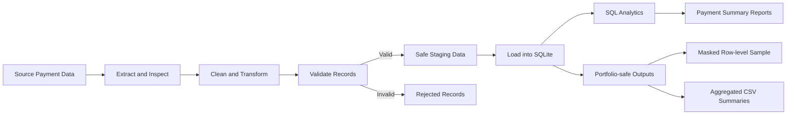

# Marketing Campaign Data Platform

An end-to-end Data Engineering project for cleaning, validating, storing, analyzing, and publishing marketing campaign payment data.

The pipeline transforms source-derived payment records into structured datasets, separates rejected records, loads validated data into SQLite, generates analytical reports, and exports portfolio-safe outputs without exposing real influencer names.

---

## Project Overview

This project demonstrates a practical data pipeline using:

- Python
- Pandas
- SQL
- SQLite
- CSV processing
- Data cleaning
- Data validation
- Rejected-record handling
- Database loading
- SQL aggregation
- Data-quality reporting
- Privacy-aware data publishing
- Git and GitHub

The dataset contains marketing payment information such as:

- Influencer
- Budget
- Expense type
- Post date
- Payment round
- Payment status

The pipeline converts the source data into safe, structured, and analysis-ready outputs.

---

## Pipeline Architecture



---

## Pipeline Stages

The pipeline performs the following stages:

1. Read source-derived payment records
2. Standardize column names
3. Clean influencer, budget, date, round, and status fields
4. Convert budget values into numeric data
5. Validate required fields and business rules
6. Separate invalid records into a rejected dataset
7. Create a privacy-safe staging dataset
8. Load validated records into SQLite
9. Generate SQL-based payment summaries
10. Export portfolio-safe aggregate reports
11. Replace real influencer names with consistent aliases

---

## Technologies

| Technology | Purpose |
|---|---|
| Python | Pipeline orchestration and scripting |
| Pandas | Data cleaning, validation, and transformation |
| SQL | Aggregation and analytical queries |
| SQLite | Local relational database |
| CSV | Staging, rejected, report, and portfolio outputs |
| Git | Version control |
| GitHub | Portfolio publishing |

---

## Project Structure

```text
marketing-campaign-data-platform/
├── data/
│   ├── raw/
│   ├── staging/
│   │   ├── payments_rejected.csv
│   │   ├── payments_safe.csv
│   │   └── .gitkeep
│   └── processed/
│       ├── payments_clean.csv
│       └── .gitkeep
├── database/
│   ├── marketing_analytics.db
│   └── marketing_analytics.sqbpro
├── diagrams/
├── queries/
├── reports/
│   ├── portfolio_outputs/
│   │   ├── sample_data_quality_summary.csv
│   │   ├── sample_expense_type_summary.csv
│   │   ├── sample_masked_payment_records.csv
│   │   ├── sample_monthly_payment_summary.csv
│   │   ├── sample_payment_round_summary.csv
│   │   └── sample_payment_status_summary.csv
│   ├── payment_summary.csv
│   └── .gitkeep
├── schema/
│   └── create_tables.sql
├── src/
│   ├── export/
│   │   └── export_portfolio_outputs.py
│   ├── extract/
│   ├── load/
│   │   ├── export_payment_summary.py
│   │   └── load_payments.py
│   ├── transform/
│   │   └── clean_payments.py
│   ├── utils/
│   └── validation/
│       └── validate_payments.py
├── tests/
├── .gitignore
├── image.png
├── README.md
├── requirements.txt
└── run_pipeline.py
```

Raw data, source-derived row-level files, and the SQLite database are excluded from GitHub through `.gitignore`.

Only portfolio-safe aggregated outputs and masked sample records are published.

---

## Data Model

Validated payment data is loaded into the SQLite table:

```text
payments
```

The table contains the following columns:

| Column | Type | Description |
|---|---|---|
| `payment_id` | INTEGER | Unique payment identifier |
| `influencer_name` | TEXT | Influencer name stored locally |
| `budget` | REAL | Payment or expense amount |
| `expense_type` | TEXT | Category of marketing expense |
| `post_date` | DATE | Campaign post date |
| `payment_round` | TEXT | Scheduled payment round |
| `payment_status` | TEXT | Current payment status |

The real `influencer_name` field remains inside the local database and is not exported to the public portfolio outputs.

---

## Dataset Summary

The SQLite database contains:

```text
Total payment records: 268
Date range: 2026-01-23 to 2026-05-27
```

### Expense Types

| Expense Type | Records | Total Budget |
|---|---:|---:|
| Influencer fee | 264 | 459,800.00 |
| Shipping | 3 | 333.00 |
| Operations | 1 | 65.00 |

The majority of records belong to influencer campaign fees.

---

## Payment Status Summary

| Payment Status | Records | Total Budget |
|---|---:|---:|
| Paid | 188 | 335,600.00 |
| Unpaid | 45 | 88,900.00 |
| Unspecified | 35 | 35,698.00 |

Payment statuses are normalized into three portfolio reporting groups:

```text
ทำจ่ายแล้ว
ยังไม่ทำจ่าย
ไม่ระบุสถานะ
```

Records without a payment status are retained and reported instead of being silently removed.

---

## Rejected-record Handling

The pipeline separates invalid or unusable records from valid records.

Rejected records are stored in:

```text
data/staging/payments_rejected.csv
```

Validated and privacy-safe staging records are stored in:

```text
data/staging/payments_safe.csv
```

This design prevents invalid records from being loaded silently into the analytical database.

It also makes it possible to:

- Review rejected records
- Trace data-quality problems
- Correct source issues
- Reprocess failed records later
- Compare valid and rejected record counts

---

## Portfolio Outputs

Portfolio-safe CSV files are generated from the SQLite database with:

```bash
python src/export/export_portfolio_outputs.py
```

Output directory:

```text
reports/portfolio_outputs/
```

The export process creates six files.

---

### `sample_masked_payment_records.csv`

Contains 20 row-level sample records.

The real influencer names are replaced with consistent aliases such as:

```text
influencer_087
influencer_094
influencer_194
```

Included columns:

- Influencer alias
- Budget
- Expense type
- Post date
- Payment round
- Payment status

The same influencer receives the same alias inside the generated sample, allowing record-level review without publishing the real identity.

---

### `sample_payment_status_summary.csv`

Summarizes payment records by payment status.

Included metrics:

- Payment status
- Payment count
- Total budget
- Average budget
- Minimum budget
- Maximum budget

Missing statuses are reported as:

```text
ไม่ระบุสถานะ
```

---

### `sample_expense_type_summary.csv`

Summarizes marketing expenses by expense type.

Included metrics:

- Expense type
- Expense count
- Total budget
- Average budget
- Percentage of total budget

This output helps identify which expense categories consume the largest portion of the marketing budget.

---

### `sample_payment_round_summary.csv`

Summarizes payment activity by payment round.

Included metrics:

- Payment round
- Payment count
- Total budget
- Paid budget
- Unpaid budget
- Budget with unspecified payment status

The current dataset contains 12 payment-round groups.

---

### `sample_monthly_payment_summary.csv`

Summarizes payment records by post month.

Included metrics:

- Post month
- Payment count
- Total budget
- Average budget
- Paid budget
- Unpaid budget

The current export contains five monthly groups based on available post dates.

---

### `sample_data_quality_summary.csv`

Contains aggregate data-quality checks for the `payments` table.

Checks include:

- Total record count
- Missing influencer values
- Invalid or negative budgets
- Missing expense types
- Missing post dates
- Invalid post dates
- Missing payment statuses
- Unexpected payment statuses
- Duplicate payment identifiers

This report makes data-quality issues visible instead of hiding or silently correcting them.

---

## Privacy and Masking Strategy

Real influencer names are not published in the portfolio outputs.

The masked sample uses aliases generated with a window function:

```text
influencer_001
influencer_002
influencer_003
```

This approach provides several benefits:

- Protects personal and business-sensitive information
- Preserves row-level analytical usefulness
- Keeps repeated influencer records traceable
- Demonstrates privacy-aware Data Engineering
- Prevents accidental disclosure through GitHub

Aggregated reports do not contain influencer names.

---

## SQL Techniques Demonstrated

The portfolio export layer uses SQL techniques including:

- `COUNT`
- `SUM`
- `AVG`
- `MIN`
- `MAX`
- `ROUND`
- `CASE`
- `COALESCE`
- `NULLIF`
- `TRIM`
- `GROUP BY`
- `ORDER BY`
- Common Table Expressions
- Window functions
- `DENSE_RANK`
- Conditional aggregation
- Date grouping with `SUBSTR`

Example alias generation:

```sql
printf(
    'influencer_%03d',
    DENSE_RANK() OVER (
        ORDER BY influencer_name
    )
)
```

This creates consistent masked aliases without publishing the original names.

---

## Data Quality Principles

The project follows these data-quality principles:

### Completeness

Required fields are checked for missing values.

### Validity

Budgets and dates are checked for invalid formats and values.

### Consistency

Payment statuses and expense types are standardized before analysis.

### Traceability

Rejected records remain available locally for investigation.

### Uniqueness

Payment identifiers are checked for duplicates.

### Transparency

Missing values are reported explicitly rather than silently removed.

---

## Challenges

### Sensitive Influencer Information

The source data contains real influencer names and campaign payment details.

Publishing these values directly would create privacy and business-confidentiality risks.

The project solves this by:

- Excluding source-derived files from GitHub
- Keeping the SQLite database local
- Exporting aggregate summaries
- Replacing real names with aliases
- Publishing only portfolio-safe CSV files

### Missing Payment Statuses

Some records do not contain a payment status.

Instead of deleting these records, the export layer groups them under:

```text
ไม่ระบุสถานะ
```

This preserves the original record count and highlights incomplete operational data.

### Inconsistent Payment Rounds

Payment-round values contain multiple Thai date formats and missing values.

The project preserves the source meaning while grouping blank rounds under:

```text
ไม่ระบุรอบจ่าย
```

### Row-level Credibility Without PII Exposure

Aggregate summaries alone may not show that the pipeline processes real row-level records.

The project therefore includes a masked 20-row sample that keeps the analytical structure while protecting identities.

---

## Lessons Learned

Through this project, I learned how to:

- Build a multi-stage marketing payment pipeline
- Clean and standardize payment records with Pandas
- Separate valid and rejected data
- Load validated records into SQLite
- Design a relational payment table
- Write SQL aggregation queries
- Use conditional aggregation for payment analysis
- Generate monthly and payment-round summaries
- Detect missing and unexpected values
- Create privacy-safe row-level samples
- Mask identities with SQL window functions
- Protect databases and source-derived files with `.gitignore`
- Publish safe analytical outputs to GitHub
- Preserve data traceability and operational transparency

---

## Installation

Clone the repository:

```bash
git clone https://github.com/bodinkc30-Pete/marketing-campaign-data-platform.git
```

Move into the project directory:

```bash
cd marketing-campaign-data-platform
```

Create a virtual environment:

```bash
python -m venv .venv
```

Activate the virtual environment on Windows:

```bash
.venv\Scripts\activate
```

Install the required packages:

```bash
python -m pip install -r requirements.txt
```

---

## Run the Pipeline

Run the complete pipeline with:

```bash
python run_pipeline.py
```

The pipeline performs the main stages:

```text
Extract
→ Clean
→ Validate
→ Reject invalid records
→ Load into SQLite
→ Export reports
```

---

## Export Portfolio Outputs

After the SQLite database has been created, run:

```bash
python src/export/export_portfolio_outputs.py
```

Expected result:

```text
[SUCCESS] สร้าง sample_masked_payment_records.csv: 20 แถว
[SUCCESS] สร้าง sample_payment_status_summary.csv: 3 แถว
[SUCCESS] สร้าง sample_expense_type_summary.csv: 3 แถว
[SUCCESS] สร้าง sample_payment_round_summary.csv: 12 แถว
[SUCCESS] สร้าง sample_monthly_payment_summary.csv: 5 แถว
[SUCCESS] สร้าง sample_data_quality_summary.csv: 1 แถว
[SUCCESS] สร้าง Portfolio Outputs ครบทุกไฟล์แล้ว
[INFO] จำนวนไฟล์: 6
[INFO] จำนวนแถวรวม: 44
```

---

## Repository Safety

The repository excludes private, source-derived, and generated data.

Excluded items include:

```text
data/raw/
data/staging/payments_safe.csv
data/staging/payments_rejected.csv
data/processed/payments_clean.csv
database/marketing_analytics.db
reports/payment_summary.csv
.venv/
.env
.vscode/
```

Only portfolio-safe files inside this directory are published:

```text
reports/portfolio_outputs/
```

The `.gitignore` configuration prevents real influencer names, the local SQLite database, staging records, rejected records, and complete processed data from being committed.

---

## Key Data Engineering Skills Demonstrated

- Data Engineering
- ETL
- Python
- Pandas
- SQL
- SQLite
- Data cleaning
- Data transformation
- Data validation
- Data quality
- Rejected-record handling
- Database design
- Database loading
- Conditional aggregation
- Window functions
- Data masking
- Data privacy
- Portfolio-safe publishing
- Git and GitHub

---

## Author

Data Engineering Portfolio Project

Focused on building reliable, traceable, privacy-aware, and portfolio-safe data pipelines using Python, Pandas, SQL, and SQLite.