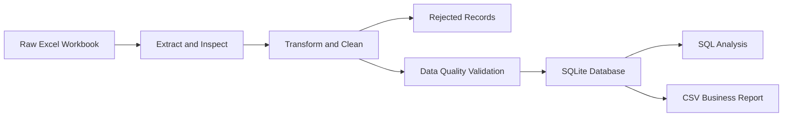

# Marketing Campaign Data Platform

An end-to-end data engineering and analytics project that transforms semi-structured influencer payment data from Excel into a validated SQLite database and automated business reports.

## Project Overview

This project demonstrates a practical data workflow for managing marketing campaign expenses.

The source Excel workbook contains influencer payments, shipping costs, operational expenses, repeated headers, summary rows, missing values, inconsistent formats, and sensitive personal information.

The pipeline cleans, validates, classifies, and loads the data into SQLite before generating SQL analysis and CSV reports.

## Business Problem

Marketing campaign payment data was stored in a semi-structured Excel workbook containing:

- Repeated table headers
- Summary rows mixed with transaction records
- Missing post dates
- Duplicate records
- Non-numeric budget values
- Multiple expense types stored in the same columns
- Inconsistent date and text formats
- Bank account and contact information
- Operational expenses mixed with influencer payments

The objective was to build a reproducible pipeline that converts the raw workbook into a structured dataset suitable for SQL analysis and business reporting.

## Data Pipeline



## Pipeline Steps

### 1. Extract

The extract process inspects the source Excel workbook and identifies:

- Worksheet names
- Row and column counts
- Relevant payment sections
- Header positions
- Data structures that require cleaning

Source file:

```text
data/raw/pawchoice/pawchoice_payments.xlsx
```

Extraction script:

```text
src/extract/inspect_excel.py
```

### 2. Transform

The transformation process converts the semi-structured workbook into a clean tabular dataset.

The process:

- Selects relevant business columns
- Removes sensitive bank and contact information
- Renames columns using database-friendly names
- Converts budget values to numeric format
- Converts post dates to a standard date format
- Removes repeated headers
- Removes summary rows
- Removes duplicate records
- Separates invalid records
- Classifies different expense types

Transformation script:

```text
src/transform/clean_payments.py
```

Clean output:

```text
data/processed/payments_clean.csv
```

Rejected output:

```text
data/staging/payments_rejected.csv
```

## Expense Classification

The source workbook contains several expense types mixed in the same payment sections.

The pipeline classifies records into the following categories:

| Expense Type | Description |
|---|---|
| `influencer_fee` | Influencer fees and additional influencer payments |
| `shipping` | Shipping and product delivery expenses |
| `operations` | Operational or campaign support expenses |
| `packaging` | Packaging-related expenses when found |

Examples of corrected classifications:

| Original Description | Budget | Expense Type |
|---|---:|---|
| Shipping-related record | 56 บาท | `shipping` |
| Shipping-related record | 100 บาท | `shipping` |
| Shipping-related record | 177 บาท | `shipping` |
| Operational expense | 65 บาท | `operations` |
| Extra Larisa | 500 บาท | `influencer_fee` |

This prevents small operational expenses from being incorrectly reported as influencer fees.

### 3. Validate

The validation process checks the cleaned dataset before loading it into the database.

Validation rules include:

- No duplicate rows
- Influencer names must not be missing
- Budgets must not be missing
- Budgets must be greater than zero
- Expense types must be valid
- Critical validation failures stop the pipeline

Missing post dates are reported but are allowed because the source workbook does not contain a post date for every record.

Validation script:

```text
src/validation/validate_payments.py
```

Allowed expense types:

```text
influencer_fee
shipping
operations
packaging
```

### 4. Load

Validated records are loaded into SQLite.

Load script:

```text
src/load/load_payments.py
```

Database file:

```text
database/marketing_analytics.db
```

Main table:

```text
payments
```

Database schema:

```text
schema/create_tables.sql
```

## Database Schema

The `payments` table contains:

| Column | Description |
|---|---|
| `payment_id` | Unique payment identifier |
| `influencer_name` | Influencer name or expense description |
| `budget` | Expense amount in Thai baht |
| `expense_type` | Classified expense category |
| `post_date` | Influencer post date |
| `payment_round` | Payment processing round |
| `payment_status` | Current payment status |

SQL schema:

```sql
CREATE TABLE IF NOT EXISTS payments (
    payment_id INTEGER PRIMARY KEY AUTOINCREMENT,
    influencer_name TEXT NOT NULL,
    budget REAL NOT NULL CHECK (budget > 0),
    expense_type TEXT NOT NULL,
    post_date DATE,
    payment_round TEXT,
    payment_status TEXT
);
```

### 5. SQL Analysis

SQL queries are stored in the `queries` directory.

```text
queries/
├── 01_payment_analysis.sql
└── 02_data_quality_checks.sql
```

The SQL analysis includes:

- Expense totals by category
- Expense counts by category
- Average expense amount
- Lowest influencer payments
- Highest influencer payments
- Duplicate detection
- Invalid budget detection
- Missing-value checks
- Unknown expense-type detection

Example query:

```sql
SELECT
    expense_type,
    COUNT(*) AS expense_count,
    SUM(budget) AS total_budget,
    ROUND(AVG(budget), 2) AS average_budget
FROM payments
GROUP BY expense_type
ORDER BY total_budget DESC;
```

### 6. Report

The pipeline exports a summary report from SQLite into CSV.

Report script:

```text
src/load/export_payment_summary.py
```

Generated report:

```text
reports/payment_summary.csv
```

## Latest Data Quality Results

Latest successful pipeline validation:

| Check | Result |
|---|---:|
| Clean rows | 268 |
| Rejected rows | 515 |
| Duplicate rows | 0 |
| Missing influencer names | 0 |
| Missing budgets | 0 |
| Invalid budgets | 0 |
| Invalid expense types | 0 |
| Missing post dates | 97 |

The 97 missing post dates remain as `NULL`.

No artificial dates were created because doing so would make the dataset inaccurate.

## Business Insights

Latest expense summary:

| Expense Type | Records | Total Budget | Average Budget |
|---|---:|---:|---:|
| Influencer fee | 264 | 459,800 บาท | 1,741.67 บาท |
| Shipping | 3 | 333 บาท | 111.00 บาท |
| Operations | 1 | 65 บาท | 65.00 บาท |

The current lowest verified influencer-related payment is:

```text
500 บาท
```

The record is associated with:

```text
extra Larisa
```

Most of the next lowest influencer payments begin at approximately:

```text
700 บาท
```

Values such as 56, 65, 100, and 177 บาท were investigated and classified as shipping or operational expenses rather than influencer fees.

## Automated Pipeline

The complete pipeline can be executed with one command:

```bash
python run_pipeline.py
```

The pipeline executes the following steps:

```text
Transform
→ Validate
→ Load
→ Export Report
```

Pipeline file:

```text
run_pipeline.py
```

Expected completion message:

```text
Pipeline completed successfully.
```

The pipeline stops automatically if a critical data quality rule fails.

## Project Structure

```text
marketing-campaign-data-platform/
├── data/
│   ├── raw/
│   │   └── pawchoice/
│   │       └── pawchoice_payments.xlsx
│   ├── staging/
│   │   ├── payments_safe.csv
│   │   └── payments_rejected.csv
│   └── processed/
│       └── payments_clean.csv
├── database/
│   └── marketing_analytics.db
├── diagrams/
├── queries/
│   ├── 01_payment_analysis.sql
│   └── 02_data_quality_checks.sql
├── reports/
│   └── payment_summary.csv
├── schema/
│   └── create_tables.sql
├── src/
│   ├── extract/
│   │   └── inspect_excel.py
│   ├── transform/
│   │   └── clean_payments.py
│   ├── validation/
│   │   └── validate_payments.py
│   ├── load/
│   │   ├── load_payments.py
│   │   └── export_payment_summary.py
│   └── utils/
├── tests/
├── .gitignore
├── README.md
├── requirements.txt
└── run_pipeline.py
```

## Technologies Used

- Python
- Pandas
- SQLite
- SQL
- OpenPyXL
- PyPDF
- DB Browser for SQLite
- Visual Studio Code
- Mermaid

## Installation

Install the required Python packages:

```bash
pip install -r requirements.txt
```

Current dependencies:

```text
pandas
openpyxl
pypdf
```

## Running Individual Steps

Run transformation:

```bash
python src/transform/clean_payments.py
```

Run validation:

```bash
python src/validation/validate_payments.py
```

Load data into SQLite:

```bash
python src/load/load_payments.py
```

Export the summary report:

```bash
python src/load/export_payment_summary.py
```

Run the complete automated pipeline:

```bash
python run_pipeline.py
```

## Data Privacy

Sensitive information from the original workbook is not included in the processed dataset or database.

Excluded information includes:

- Bank account numbers
- Phone numbers
- Addresses
- Personal contact details
- Other sensitive payment information

Raw source files should not be committed to a public repository.

## Data Engineering Responsibilities Demonstrated

This project demonstrates practical Data Engineering work, including:

- Inspecting semi-structured source data
- Designing a repeatable data pipeline
- Cleaning inconsistent records
- Separating accepted and rejected data
- Applying business classification rules
- Enforcing data quality checks
- Designing a relational database table
- Loading data into SQLite
- Automating pipeline execution
- Generating reusable reports
- Protecting sensitive information

## Data Analyst Responsibilities Demonstrated

This project also demonstrates Data Analyst work, including:

- Investigating unusual budget values
- Identifying incorrect expense classifications
- Using SQL to find minimum and maximum payments
- Summarizing spending by expense category
- Calculating averages and totals
- Validating business assumptions against source data
- Producing reporting-ready CSV outputs

## Key Challenges

### Semi-structured Excel data

The workbook contained multiple data blocks, repeated headers, summary rows, empty rows, and mixed expense types.

The pipeline required custom business rules instead of a simple direct import.

### Incorrect expense classification

Shipping and operational expenses initially appeared as influencer payments.

SQL investigation identified these anomalies and additional classification rules were added.

### Summary rows mixed with transactions

Some summary values were incorrectly interpreted as influencer names and budgets.

The pipeline filters records whose names do not contain valid Thai or English letters.

### Missing post dates

Some valid transactions do not contain post dates.

These values remain `NULL` instead of being replaced with invented dates.

### Sensitive information

The original workbook includes personal and payment information.

Only business-safe fields are retained in the processed dataset.

## Lessons Learned

This project demonstrates that data engineering involves more than moving data from one system to another.

Reliable pipelines require:

- Understanding the source structure
- Investigating anomalies
- Defining clear business rules
- Protecting sensitive information
- Separating valid and invalid records
- Validating data before loading
- Designing reproducible workflows
- Using SQL to verify transformation results
- Automating repeated processing steps

## Future Improvements

Potential future improvements include:

- Add automated unit tests
- Add structured logging
- Add rejection reasons for every invalid record
- Create separate influencer and campaign tables
- Add campaign identifiers
- Add a date dimension table
- Add indexes for frequently queried columns
- Build a Power BI or Tableau dashboard
- Migrate SQLite to PostgreSQL
- Schedule the pipeline with Apache Airflow
- Add configuration files for business rules
- Add historical pipeline run logs
- Add automated data quality reports